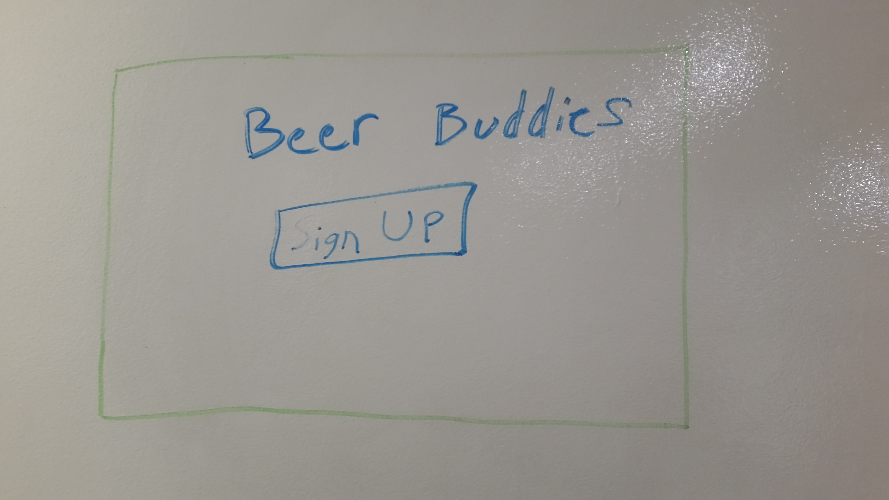
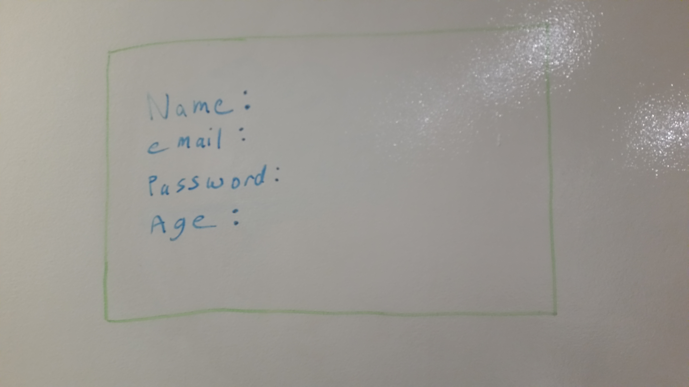

#Beer Buddies

####1. Project Description
An app where bars can post the day, time, location, and specific details of their specials/happy hours for users to peruse.  Users can then reply with comments and/or RSVP for the meet up.  Essentially a Groupon Meetup for bars.

####2. Technologies Used
- HTML
- CSS
- Ruby on Rails
- PostgreSQL
- Trello
- Git & Github
- Heroku

####3. Approach taken
- Constructed ERD
- Sketched out Wireframes
- Generated my models
- Created my controllers
- Built out controller actions, routes, and view templates

####4. Installation/Startup instructions
1. Clone the repository
2. Open app directory
3. Install gems
4. Open Rails server
5. In browser open: localhost:3000

####5. Unsolved Problems
- Navigation links are working, but poor user experience flow
- Users response(comments) model is not functional

####6. Next Steps
- Styling
- Enable user comments on the bar posts
- Build an RSVP function into the posts for users to accept
- Once the RSVP function is built out, would love to randomly match those that chose yes

####6. User Stories
[Link to Trello] (https://trello.com/b/94HGeJtc/wdi-sm-43-project-2)

####7. ERD

####8. Wireframes

