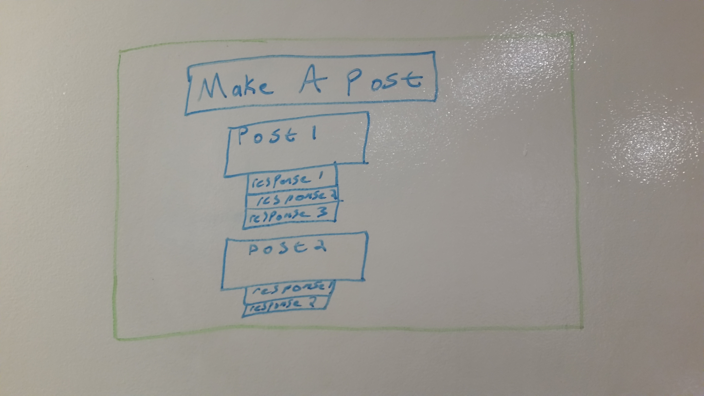
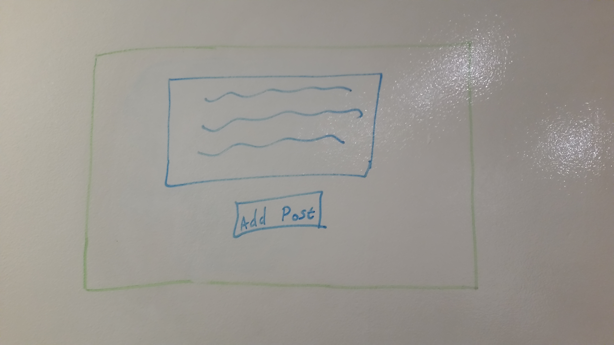
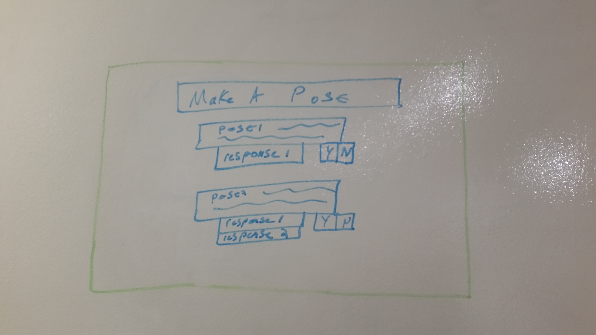

#Beer Buddies

####1. Project Description
An app where users can post a suggested hang out at a local bar on a certain date/time.  Other users can then reply with comments and/or RSVP for the meet up.

####2. Technologies Used
- Git Hub
- Ruby on Rails
- Heroku
- HTML
- Bootstrap?

####3. Approach taken

####4. Installation/Startup instructions

####5. Unsolved Problems/Next Steps
-Users are not able to leave comments or RSVP to events

####6. User Stories
[Link to Trello] (https://trello.com/b/94HGeJtc/wdi-sm-43-project-2)

####7. ERD

####8. Wireframes

